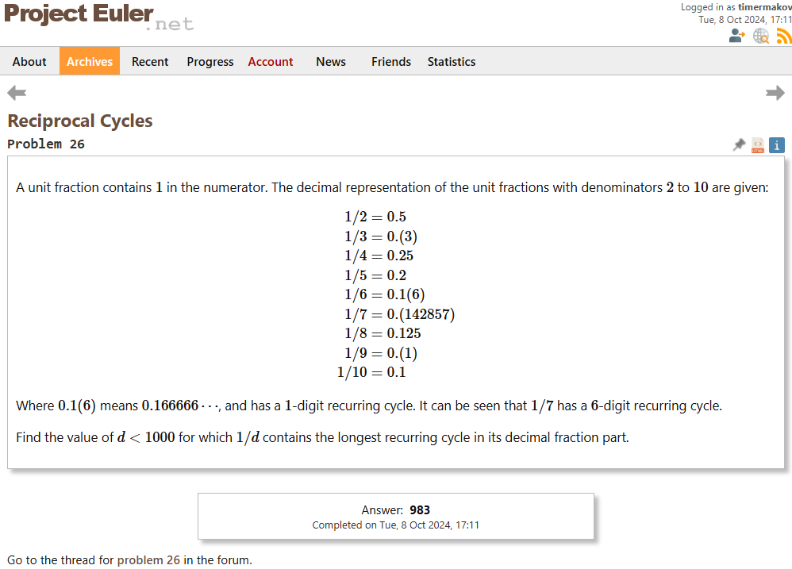

## Выполнил

- ФИО: `Ермаков Тимофей Сергеевич`
- Номер ИСУ: `311733`
- Группа: `P34092`
- Вариант: `7,26`

## Задание 7


## Решение задания 7

```clojure
(ns problem7.core
  (:gen-class))

; Монолитная реализация с использованием хвостовой рекурсии
(defn nth-prime-tail-recursion [n count num divisor]
  (cond
    (= count n) (dec num)
    (> divisor (Math/sqrt num)) (recur n (inc count) (inc num) 2)
    (zero? (mod num divisor)) (recur n count (inc num) 2)
    :else (recur n count num (inc divisor))))

; Монолитная реализация с использованием рекурсии 
(defn nth-prime-recursion [n]
  (letfn [(is-prime? [num divisor]
            (if (> (* divisor divisor) num)
              true
              (if (zero? (mod num divisor))
                false
                #(is-prime? num (inc divisor)))))
          (find-prime [count num]
            (if (= count n)
              #(dec num)
              (if (trampoline is-prime? num 2)
                #(find-prime (inc count) (inc num))
                #(find-prime count (inc num)))))]
    (trampoline find-prime 0 2)))

; Модульная реализация с использованием filter
(defn is-prime? [n]
  (letfn [(check [divisor]
            (cond
              (> (* divisor divisor) n) true
              (zero? (mod n divisor)) false
              :else (check (inc divisor))))]
    (check 2)))

(defn nth-prime-modular [n]
  (nth (filter is-prime? (iterate inc 2)) (dec n)))

; Генерация последовательности при помощи отображения (map)
(defn nth-prime-map [n]
  (nth (map first
            (filter second
                    (map (fn [num]
                           [num (is-prime? num)])
                         (iterate inc 2))))
       (dec n)))

; Работа со специальным синтаксисом для циклов (for)
(defn nth-prime-for [n]
  (nth (for [num (iterate inc 2)
             :when (is-prime? num)]
         num)
       (dec n)))

; Работа с бесконечными списками (ленивые коллекции)
(defn primes []
  (filter is-prime? (iterate inc 2)))

(defn nth-prime-lazy [n]
  (nth (primes) (dec n)))

(defn -main
  "Solutions for problem 7"
  [& args]
  (println "Monolith tail recursion:")
  (println (nth-prime-tail-recursion 10001 0 2 2))
  (println "Monolith non-tail recursion:")
  (println (nth-prime-recursion 10001))
  (println "Modular:")
  (println (nth-prime-modular 10001))
  (println "Map:")
  (println (nth-prime-map 10001))
  (println "For:")
  (println (nth-prime-for 10001))
  (println "Lazy:")
  (println (nth-prime-lazy 10001)))
```

### Тесты

[Тесты](/lab1/problem7/test/problem7/core_test.clj)

### Реализация на традиционном языке программирования для сравнения

```python
import math

def check_prime(num):
    i = 2
    max = math.sqrt(num)
    while i <= max:
        if num % i == 0:
            return 0
        i += 1
    return 1

def solution(n):
    counter = 0
    primes = 1
    while counter < n:
        primes += 1
        if check_prime(primes):
            counter += 1
    return primes

print(solution(10001))
```

## Задание 26



## Решение задания 26

```clojure
(ns problem26.core
  (:gen-class))

(defn recurring-cycle-length [d]
  (letfn [(cycle-length [n rems pos]
            (let [rem (mod (* 10 n) d)]
              (cond
                (= rem 0) 0
                (contains? rems rem) (- pos (rems rem))
                :else (recur rem (assoc rems rem pos) (inc pos)))))]
    (cycle-length 1 {} 0)))

; Монолитная реализация с использованием хвостовой рекурсии
(defn recurring-tail-recursion [d limit max-d max-len]
  (if (>= d limit)
    max-d
    (let [len (recurring-cycle-length d)]
      (if (> len max-len)
        (recur (inc d) limit d len)
        (recur (inc d) limit max-d max-len)))))

; Монолитная реализация с использованием рекурсии 
(defn recurring-recursion [d limit max-d max-len]
  (if (>= d limit)
    max-d
    (let [len (recurring-cycle-length d)]
      (if (> len max-len)
        (recurring-recursion (inc d) limit d len)
        (recurring-recursion (inc d) limit max-d max-len)))))

; Модульная реализация с использованием filter
(defn generate-cycle-lengths [limit]
  (map (fn [d] [d (recurring-cycle-length d)]) (range 2 limit)))

(defn filter-non-zero-cycles [pairs]
  (filter (fn [[_ length]] (pos? length)) pairs))

(defn find-max-cycle [pairs]
  (reduce (fn [max-pair current-pair]
            (if (> (second current-pair) (second max-pair))
              current-pair
              max-pair))
          [0 0]
          pairs))

(defn recurring-modular [limit]
  (let [pairs (generate-cycle-lengths limit)
        filtered-pairs (filter-non-zero-cycles pairs)
        [d _] (find-max-cycle filtered-pairs)]
    d))

; Генерация последовательности при помощи отображения (map)
(defn recurring-map [limit]
  (first (apply max-key second
                (map (fn [d] [d (recurring-cycle-length d)])
                     (range 2 limit)))))

; Работа со специальным синтаксисом для циклов (for)
(defn recurring-for [limit]
  (let [lengths (for [d (range 2 limit)]
                  [d (recurring-cycle-length d)])]
    (first (apply max-key second lengths))))

; Итератор
(defn recurring-iterator [limit]
  (let [state (atom 1)]
    (defn next-pair []
      (let [d (swap! state inc)]
        (when (< d limit)
          [d (recurring-cycle-length d)])))
    (defn pairs []
      (lazy-seq
       (when-let [pair (next-pair)]
         (cons pair (pairs)))))
    (first (apply max-key second (pairs)))))

(defn -main
  "Solutions for problem 26"
  [& args]
  (println "Monolith tail recursion:")
  (println (recurring-tail-recursion 2 1000 0 0))
  (println "Monolith recursion:")
  (println (recurring-recursion 2 1000 0 0))
  (println "Modular:")
  (println (recurring-modular 1000))
  (println "Map:")
  (println (recurring-map 1000))
  (println "For:")
  (println (recurring-for 1000))
  (println "Iterator:")
  (println (recurring-iterator 1000)))
```

### Тесты

[Тесты](/lab1/problem26/test/problem26/core_test.clj)

### Реализация на традиционном языке программирования для сравнения

```python
def reciprocal_cycles(n):
    max_number = 0
    result = 1
    for number in range(1, n):
        new_list = []
        x = 1
        rem = 0
        rec_num = 0
        while rem not in new_list:
            new_list.append(rem)
            rem = x % number
            x = rem * 10
            rec_num += 1
        if max_number < rec_num:
            max_number = rec_num
            result = number
    return result

print(reciprocal_cycles(1000))
```

# Выводы

В ходе лабораторной работы были реализованы различные подходы к решению математических задач на языке Clojure. Поначалу очень непривычно использовать менять мышление с императивного на функциональное, однако со временем, становится понятнее и проще.

Использование хвостовой рекурсии позволило создать эффективную монолитную функцию без переполнения стека. В реализация с обычной рекурсией использовались вложенные функции, letfn, trampoline.

Модульный подход с использованием функций высшего порядка (filter, map, nth) показал силу функционального программирования в обработке и преобразовании последовательностей. Использование ленивых коллекций позволило эффективно работать с бесконечными последовательностями без излишней нагрузки на память.

Cинтаксис циклов for предоставил способ генерации и фильтрации данных в одном выражении.

В целом, использование идиоматических приемов языка Clojure представило для меня возможность решения задач в другом свете и подчеркнуло преимущества функционального подхода в обработке данных.
