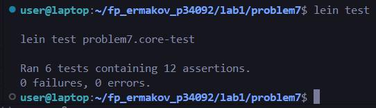
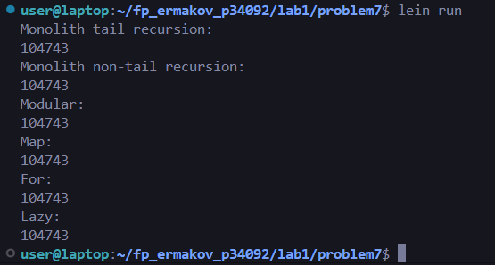

# Problem 7 - 10001st Prime

By listing the first six prime numbers: 2, 3, 5, 7, 11, and 13, we can see that the 6'th prime is 13. 

What is the 10001'st prime number?

## Installation

Clone repository

Download [Leiningen](https://leiningen.org/#install)

## Usage

	lein test
	lein run

